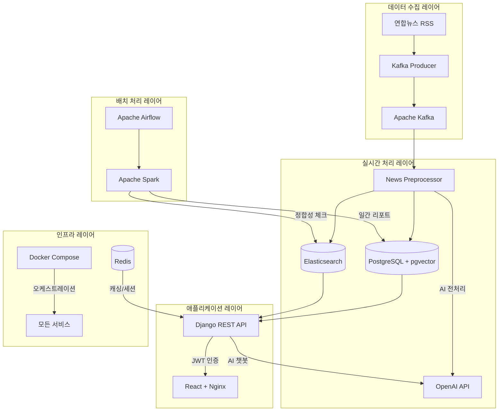

# 📰 SSAFY News Platform - AI 기반 맞춤형 뉴스 추천 시스템

> **종합 뉴스 플랫폼**: RSS 기반 실시간 뉴스 수집 → AI 전처리 → 벡터 기반 개인화 추천 → 웹 서비스 제공

[](https://python.org)
[](https://djangoproject.com)
[](https://reactjs.org)
[](https://docker.com)
[](https://kafka.apache.org)
[](https://elastic.co)

---

## 🎯 프로젝트 개요

**SSAFY News Platform**은 실시간 뉴스 수집부터 AI 기반 개인화 추천까지 전체 파이프라인을 구현한 종합 뉴스 서비스입니다.

### 🌟 핵심 기능
- **🤖 AI 기반 개인화 추천**: pgvector 코사인 유사도를 활용한 맞춤형 뉴스 추천
- **⚡ 실시간 뉴스 수집**: Kafka + RSS 크롤링을 통한 연합뉴스 자동 수집
- **🔍 지능형 검색**: Elasticsearch 기반 전문 검색 및 카테고리 필터링
- **💬 AI 챗봇**: OpenAI GPT-4를 활용한 뉴스 기사 질의응답
- **📊 개인화 대시보드**: 사용자별 뉴스 소비 패턴 시각화
- **🐳 완전 컨테이너화**: Docker Compose 기반 원클릭 배포

---

## 🏗️ 시스템 아키텍처



### 📊 데이터 흐름

```
RSS 피드 → Kafka Producer → Kafka → News Preprocessor → PostgreSQL/Elasticsearch
                                                    ↓
                            Airflow/Spark ← 배치 처리 ← 정합성 체크
                                                    ↓
                            Django API ← 벡터 검색/추천 ← React Frontend
```

---

## 🚀 빠른 시작 (Docker 방식)

### 1️⃣ 환경 설정
```bash
# 레포지토리 클론
git clone <repository-url>
cd data-pjt-seho-jungrae

# 환경 변수 설정
cp .env.example .env
# .env 파일에서 OpenAI API 키, DB 패스워드 등 실제 값으로 수정
```

### 2️⃣ Docker 컨테이너 실행
```bash
# 초기 설정 (Linux/Mac)
chmod +x docker/scripts/*.sh
./docker/scripts/setup.sh

# 이미지 빌드
./docker/scripts/build.sh

# 서비스 시작
./docker/scripts/deploy.sh start
```

### 3️⃣ 서비스 접속
- **Frontend**: http://localhost
- **Backend API**: http://localhost/api
- **Django Admin**: http://localhost/admin
- **Elasticsearch**: http://localhost:9200

### 4️⃣ 초기 데이터 설정
```bash
# Django 마이그레이션
./docker/scripts/deploy.sh init-db

# 슈퍼유저 생성 (선택)
docker-compose exec backend python manage.py createsuperuser
```

---

## 📁 프로젝트 구조

```
data-pjt-seho-jungrae/
├── 📱 frontend/                    # React 18 + Vite 프론트엔드
│   ├── src/
│   │   ├── components/             # 재사용 컴포넌트
│   │   ├── views/                 # 페이지 컴포넌트
│   │   ├── router/                # React Router 설정
│   │   └── assets/                # 정적 자원
│   └── package.json
│
├── 🖥️ backend/                     # Django 4.2.20 백엔드
│   ├── myproject/                 # Django 프로젝트 설정
│   ├── mynews/                    # 뉴스 관련 앱
│   ├── members/                   # 사용자 관리 앱
│   └── requirements.txt
│
├── 📡 producer/                    # Kafka Producer (RSS 크롤러)
│   ├── produce.py                 # 연합뉴스 RSS 수집
│   └── README.md
│
├── ⚙️ consumer/                    # Kafka Consumer (AI 전처리)
│   ├── news_preprocessor.py       # 메인 처리 로직
│   ├── flink_processor.py         # Flink 기반 처리기
│   ├── preprocess.py             # AI 전처리 클래스
│   └── README.md
│
├── 🗓️ batch/                       # Airflow + Spark 배치
│   ├── dags/                     # Airflow DAG 정의
│   ├── docker-compose.yaml       # Airflow 환경
│   └── README.md
│
├── 🐳 docker/                      # Docker 설정
│   ├── *.Dockerfile              # 서비스별 Dockerfile
│   ├── docker-compose.yml        # 메인 오케스트레이션
│   ├── requirements/             # 서비스별 의존성
│   └── scripts/                  # 자동화 스크립트
│
├── 🔍 search/                      # 검색 엔진 설정
│   ├── elasticsearch_setup.py    # ES 인덱스 생성
│   └── README.md                 # 검색 설정 가이드
│
├── 🔧 scripts/                     # 유틸리티 스크립트
│   ├── news_processor_standalone.py # 독립 실행형 처리기
│   ├── extract_pgvector_test.py  # 테스트 스크립트
│   ├── load_pgvector_test.py     # DB 연결 테스트
│   ├── insert_csv_to_psql.py     # CSV 데이터 삽입
│   └── README.md                 # 스크립트 가이드
│
├── ⚙️ config/                      # 설정 파일 모음
│   ├── docker-compose-elastic.yml # Elasticsearch 스택
│   └── README.md                 # 설정 파일 가이드
│
├── 📚 docs/                        # 문서 모음
│   └── README.md                 # 문서 인덱스
│
├── 📋 api_docs/                   # API 문서 및 ERD
├── 🌍 total_readme.md             # 종합 프로젝트 가이드
└── 🔧 .env.example               # 환경 변수 템플릿
```

---

## 🛠️ 기술 스택

### **Frontend**
- **React 18** + **Vite**: 최신 프론트엔드 프레임워크
- **Vue Router 4**: SPA 라우팅
- **Pinia**: 상태 관리
- **Chart.js**: 대시보드 시각화
- **Axios**: HTTP 클라이언트
- **SCSS**: 스타일링

### **Backend**
- **Django 4.2.20** + **DRF**: REST API 서버
- **PostgreSQL 15** + **pgvector**: 벡터 유사도 검색
- **JWT**: 토큰 기반 인증
- **LangChain** + **OpenAI GPT-4**: AI 챗봇
- **Redis**: 캐싱 및 세션 관리

### **Data Pipeline**
- **Apache Kafka**: 실시간 메시지 큐
- **Elasticsearch 8.8**: 전문 검색 엔진
- **Apache Airflow**: 워크플로우 오케스트레이션
- **Apache Spark**: 분산 데이터 처리

### **Infrastructure**
- **Docker Compose**: 컨테이너 오케스트레이션
- **Nginx**: 리버스 프록시 및 정적 파일 서빙
- **Gunicorn**: WSGI 서버

---

## 🔧 주요 서비스 상세

### 🤖 AI 전처리 시스템 (Consumer)

**news_preprocessor.py**는 시스템의 핵심 컴포넌트로, Kafka에서 수신한 원시 뉴스 데이터를 AI 기반으로 전처리합니다:

```python
# 주요 전처리 기능
- 뉴스 본문 정제 및 기자명 추출
- OpenAI를 활용한 키워드 추출 (5개)
- 카테고리 자동 분류 (15개 카테고리)
- 텍스트 임베딩 생성 (1536차원)
- PostgreSQL 및 Elasticsearch 동시 저장
```

### 🔍 개인화 추천 엔진

**pgvector 코사인 유사도** 기반 다중 추천 알고리즘:

1. **사용자 좋아요 기반 추천**: 좋아요한 기사들의 임베딩 평균으로 유사 기사 추천
2. **콘텐츠 기반 추천**: 현재 기사와 유사한 다른 기사 추천
3. **카테고리별 필터링**: 사용자 관심 카테고리 기반 추천

### 💬 AI 챗봇 시스템

**OpenAI GPT-4** 기반 기사별 질의응답:
- 뉴스 기사 내용을 컨텍스트로 제공
- 세션 기반 대화 이력 관리
- 기사 범위를 벗어난 질문 차단

### 📊 실시간 모니터링

**종합 모니터링 대시보드**:
```bash
# 실시간 시스템 모니터링
./docker/scripts/monitor.sh monitor

# 서비스별 로그 분석
./docker/scripts/monitor.sh logs backend

# 성능 메트릭 확인
./docker/scripts/monitor.sh performance
```

---

## 🎨 사용자 인터페이스

### 🏠 메인 페이지
- **카테고리별 뉴스**: 15개 뉴스 카테고리 필터링
- **정렬 옵션**: 최신순, 추천순, 인기순
- **실시간 검색**: Elasticsearch 기반 전문 검색

### 📰 뉴스 상세 페이지
- **기사 전문**: 원문 링크 및 내용 표시
- **관련 기사**: 벡터 유사도 기반 추천
- **AI 챗봇**: 기사 관련 질의응답
- **댓글 시스템**: 사용자 의견 교환

### 📈 개인화 대시보드
- **읽기 패턴**: 일별/주별 뉴스 소비량
- **관심 카테고리**: 좋아요 기반 선호도 분석
- **키워드 클라우드**: 자주 읽은 뉴스 키워드
- **추천 정확도**: 개인화 추천 성능 지표

---

## 🔒 보안 및 인증

### 🛡️ 보안 설정
- **JWT 토큰**: 액세스/리프레시 토큰 기반 인증
- **CORS 설정**: 교차 출처 요청 제어
- **환경 변수**: 민감 정보 분리 관리
- **SSL/TLS**: HTTPS 지원 (프로덕션)

### 🔐 데이터 보호
- **PostgreSQL**: 사용자 데이터 암호화
- **Redis**: 세션 데이터 보안
- **API 접근 제어**: 인증된 사용자만 접근

---

## 📊 데이터베이스 스키마

### 📰 뉴스 기사 테이블
```sql
CREATE TABLE news_article (
    id SERIAL PRIMARY KEY,
    title VARCHAR(200) NOT NULL,
    writer VARCHAR(255) NOT NULL,
    write_date TIMESTAMP NOT NULL,
    category VARCHAR(50) NOT NULL,
    content TEXT NOT NULL,
    url VARCHAR(200) UNIQUE NOT NULL,
    keywords VARCHAR(100),              -- AI 추출 키워드 5개
    embedding VECTOR(1536) NOT NULL,    -- OpenAI 임베딩
    updated_at TIMESTAMP DEFAULT now()
);
```

### 👤 사용자 상호작용 테이블
```sql
-- 좋아요 테이블
CREATE TABLE likes (
    id SERIAL PRIMARY KEY,
    user_id INTEGER REFERENCES members_user(id),
    article_id TEXT REFERENCES news_article(url),
    UNIQUE (user_id, article_id)
);

-- 읽음 기록 테이블
CREATE TABLE reads (
    id SERIAL PRIMARY KEY,
    user_id INTEGER REFERENCES members_user(id),
    article_id TEXT REFERENCES news_article(url),
    read_at TIMESTAMP DEFAULT CURRENT_TIMESTAMP
);
```

---

## 🚀 배포 및 운영

### 🐳 Docker 배포
```bash
# 프로덕션 배포
./docker/scripts/deploy.sh start production

# 서비스 상태 확인
./docker/scripts/deploy.sh status

# 로그 모니터링
./docker/scripts/monitor.sh logs [서비스명]

# 데이터 백업
./docker/scripts/deploy.sh backup
```

### 📈 확장성
- **수평 확장**: Consumer 서비스 스케일링 지원
- **로드 밸런싱**: Nginx 기반 트래픽 분산
- **캐싱 최적화**: Redis 기반 응답 속도 향상
- **DB 최적화**: pgvector 인덱스 최적화

### 🔧 유지보수
```bash
# 이미지 업데이트
./docker/scripts/build.sh

# 무중단 재시작
./docker/scripts/deploy.sh restart

# 데이터베이스 마이그레이션
docker-compose exec backend python manage.py migrate
```

---

## 🧪 테스트 및 품질 관리

### ✅ 테스트 커버리지
- **Unit Test**: Django 모델 및 뷰 테스트
- **Integration Test**: API 엔드포인트 테스트
- **E2E Test**: 전체 파이프라인 테스트

### 📋 코드 품질
- **Linting**: ESLint (Frontend), Flake8 (Backend)
- **Formatting**: Prettier, Black
- **Type Checking**: TypeScript (부분 적용)

---

## 🔮 향후 개발 계획

### 🚀 단기 목표 (1-2개월)
- [ ] **다중 언론사 지원**: 조선일보, 동아일보 등 RSS 추가
- [ ] **실시간 알림**: WebSocket 기반 브레이킹 뉴스 알림
- [ ] **모바일 최적화**: PWA 기능 추가
- [ ] **검색 개선**: 검색어 자동완성 및 추천

### 🎯 중기 목표 (3-6개월)
- [ ] **ML 모델 확장**: 사용자 행동 기반 추천 모델
- [ ] **소셜 기능**: 뉴스 공유 및 토론 기능
- [ ] **다국어 지원**: 영어 뉴스 서비스
- [ ] **성능 최적화**: CDN 및 캐싱 전략 고도화

### 🌟 장기 목표 (6개월 이상)
- [ ] **뉴스 요약**: AI 기반 자동 요약 서비스
- [ ] **팩트체킹**: 가짜뉴스 탐지 시스템
- [ ] **개인화 뉴스레터**: 이메일 기반 맞춤 뉴스
- [ ] **오픈 API**: 외부 개발자용 뉴스 API 제공

---

## 🤝 기여 가이드

### 🔧 개발 환경 설정
```bash
# 개발 환경 실행
docker-compose -f docker-compose.yml -f docker-compose.override.yml up -d

# Frontend 개발 서버
cd frontend && npm run dev

# Backend 개발 서버
cd backend && python manage.py runserver
```

### 📝 커밋 컨벤션
```
feat: 새로운 기능 추가
fix: 버그 수정
docs: 문서 수정
style: 코드 스타일 변경
refactor: 코드 리팩토링
test: 테스트 코드 추가
chore: 빌드 설정 변경
```

---

## 📞 지원 및 문의

### 🐛 이슈 리포팅
GitHub Issues를 통해 버그 리포트 및 기능 요청을 제출해주세요.

### 📚 문서
- **API 문서**: `/api_docs/` 디렉토리
- **기술 문서**: `docs.md` 파일
- **Docker 가이드**: `docker/README.md` 파일

### 🔧 트러블슈팅
```bash
# 서비스 상태 확인
./docker/scripts/deploy.sh status

# 로그 확인
./docker/scripts/monitor.sh logs [서비스명]

# 헬스체크
./docker/scripts/monitor.sh monitor
```

---

## 📄 라이선스

이 프로젝트는 SSAFY 교육 과정의 일환으로 개발되었습니다.

---

## 🙏 감사의 글

이 프로젝트는 다음 오픈소스 프로젝트들의 도움을 받아 개발되었습니다:

- **Django**: 강력한 웹 프레임워크
- **React**: 유연한 UI 라이브러리
- **Apache Kafka**: 신뢰할 수 있는 스트리밍 플랫폼
- **Elasticsearch**: 강력한 검색 엔진
- **PostgreSQL**: 안정적인 관계형 데이터베이스
- **Docker**: 컨테이너화 플랫폼

---

<div align="center">

**🏆 SSAFY 11기 관통프로젝트 🏆**

*AI 기반 맞춤형 뉴스 추천 시스템*

[](https://github.com)
[](https://ssafy.com)

</div>